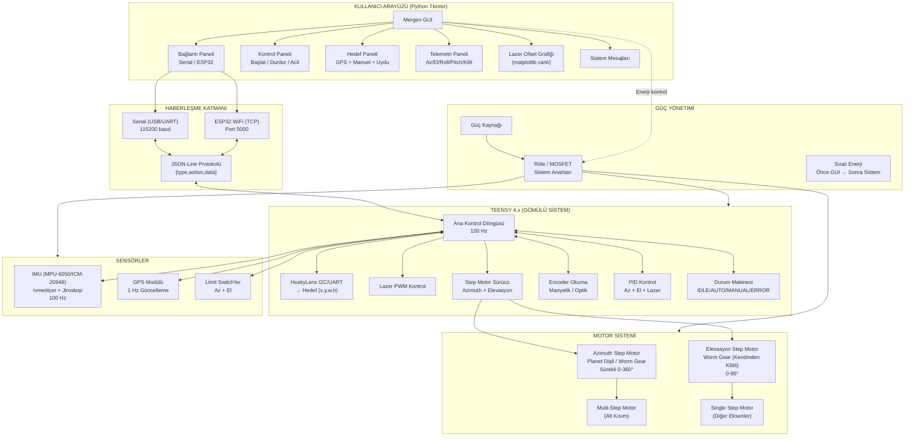
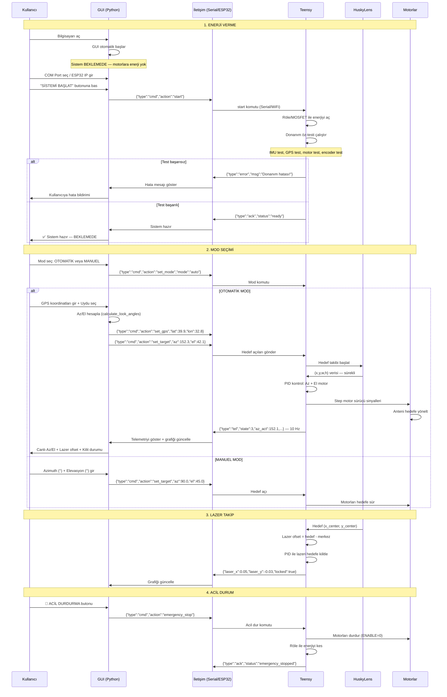
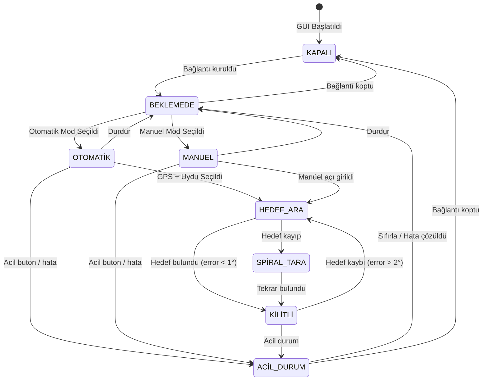

# Mergen Sistemi — Mimarî Akış Diyagramı



## SİSTEM ÇALIŞMA AKIŞI



## ONAYLI VERİ AKIŞI (JSON-Line Protokolü)

```mermaid
flowchart LR
    subgraph TX["GUI → Teensy Komutları"]
        C1["START<br/>{type:cmd, action:start}"]
        C2["STOP<br/>{type:cmd, action:stop}"]
        C3["SET_MODE<br/>{mode:auto/manual}"]
        C4["SET_TARGET<br/>{az:120.0, el:30.0}"]
        C5["SET_GPS<br/>{lat:39.9, lon:32.8}"]
        C6["EMERGENCY<br/>{action:emergency_stop}"]
        C7["HOME<br/>{action:home}"]
    end

    subgraph RX["Teensy → GUI Telemetrisi"]
        T1["TELEMETRY (10Hz)<br/>{type:tel, state, az_act, el_act,<br/>laser_x, laser_y, locked,<br/>roll, pitch, errors, ...}"]
        T2["ACK<br/>{type:ack, status:ready}"]
        T3["LOG<br/>{type:log, msg:Homing OK}"]
        T4["ERROR<br/>{type:error, msg:IMU fault}"]
    end

    TX -->|JSON\nSerial/WiFi| RX
    RX -->|JSON\nSerial/WiFi| TX
```



## ARAYÜZ DURUM MAKİNESİ



## Klasör Yapısı

```
yazilim/arayuz/
├── main.py                    # Ana GUI (Tkinter + ttk + matplotlib)
├── requirements.txt           # pyserial, matplotlib, Pillow
├── comm/
│   ├── __init__.py
│   ├── protocol.py            # JSON-Line protokol tanımları
│   └── io_handler.py          # Serial + ESP32 IO yöneticisi
├── core/
│   ├── __init__.py
│   ├── satellite_pointing.py  # GPS → Az/El hesaplama
│   └── system_state.py        # Sistem durumu veri modeli
└── widgets/
    └── __init__.py
```
